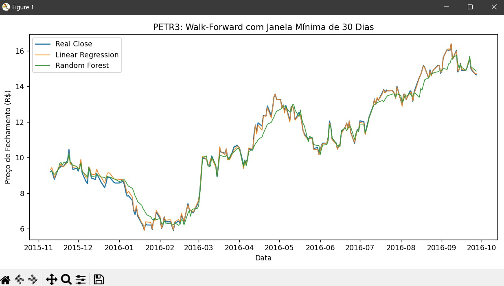
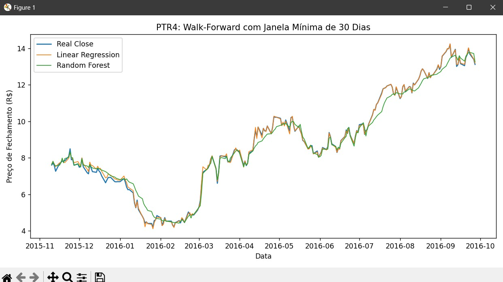

# Previsão de Preços das Ações PETR3 e PETR4 com Machine Learning

Este projeto aplica técnicas de machine learning para prever os preços de fechamento das ações PETR3 e PETR4 da Petrobras utilizando validação Walk-Forward com uma janela mínima de 30 dias.

## 📊 Objetivo

Prever os preços de fechamento das ações PETR3 e PETR4 com modelos de Regressão Linear e Random Forest, comparando os resultados com os dados reais históricos da B3.

## 🧪 Tecnologias Utilizadas

- *Python 3.10+*
- *pandas* para manipulação de dados
- *matplotlib* para visualização
- *scikit-learn* para modelagem com regressão linear e Random Forest

## ⚙ Como Funciona

1. Os dados são carregados a partir do Bovespa.csv, contendo preços históricos de várias ações.
2. É feita a filtragem dos tickers PETR3 e PETR4.
3. Criamos uma variável derivada Close_lag1 para representar o fechamento do dia anterior.
4. Aplicamos a técnica de validação Walk-Forward:
   - Aplicamos a técnica de validação Walk-Forward, onde o modelo é treinado utilizando uma janela mínima de 30 dias e está sempre melhorando suas previsões.
5. Dois modelos são testados:
   - LinearRegression()
   - RandomForestRegressor(n_estimators=100, max_depth=5)

## 📈 Resultados

### PETR3:

### PETR4:

Os gráficos mostram que o modelo Random Forest é mais sensível a mudanças e apresenta melhores previsões em momentos de volatilidade, enquanto a Regressão Linear segue a tendência geral.

## 📌 Recomendações Futuras

- Incluir indicadores técnicos como médias móveis ou RSI.
- Testar outros modelos como XGBoost ou LSTM.
- Avaliar com métricas como RMSE e R².
